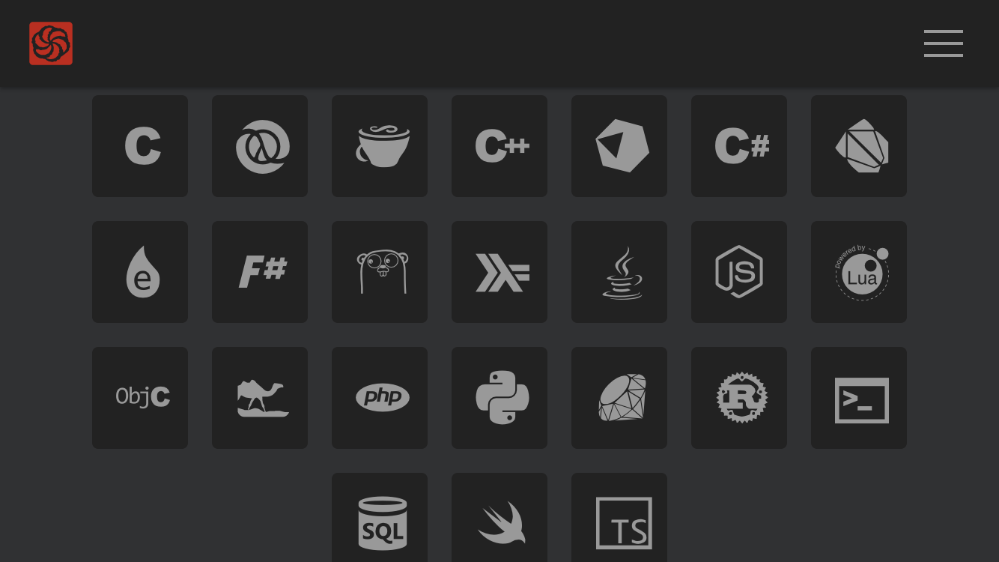
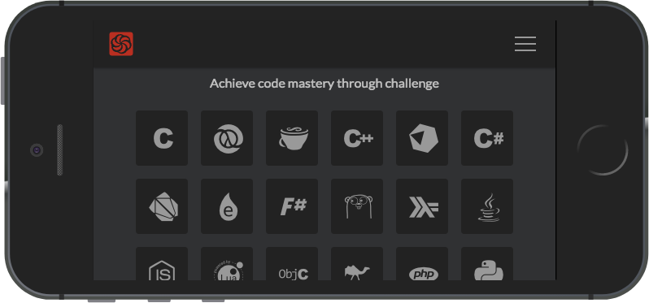
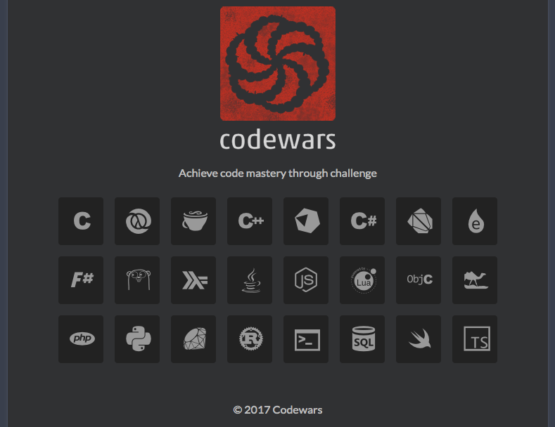
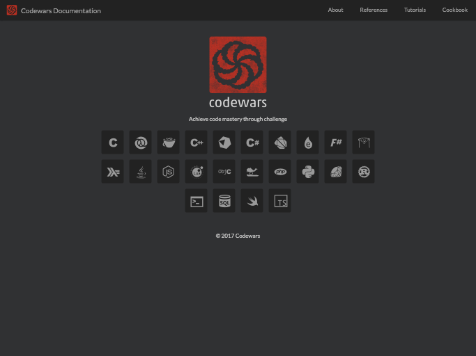

<https://kazk.github.io/docs.codewars.com/>

POC of GitHub Pages for [Codewars/codewars.com](https://github.com/Codewars/codewars.com).

See [docs/README.md](docs/README.md) for further details.

## Features

- Allows contributions from the community to improve the documentation.
  - Mostly markdown, [kramdown](https://kramdown.gettalong.org/index.html) with GFM parser.
  - Contributions goes live quickly and automatically once merged.
- Reduced cost of maintenance by taking advantage of templates, data files, and YAML front matter.
- Documentations are organized by topic and target.
- Responsive design (WIP).
- Improved readability (WIP).

## Screenshots

Styling is temporary and work in progress, images can be outdated.

Concepts are "simple", "obvious", "readable", "responsive" and being "uniform" with Codewars.

